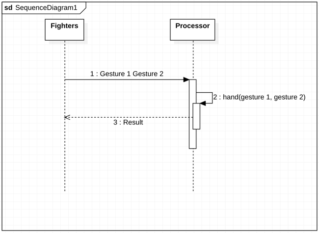
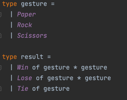
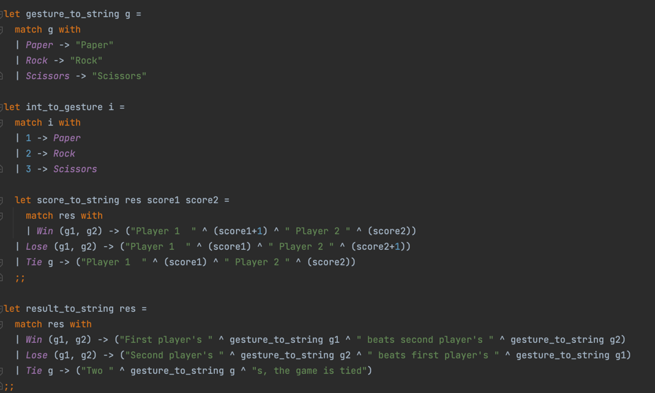

# Project of Functionnal Programming

### Presentation of the game :

Rock Paper Scisors game play is as follow: 
- There is two players, they have to choose between rock, paper and scisors
- The result of the game is either win, lose or tie from the point of view of player one such as : scisors wins over paper, paper wins over rock and rock wins over scisors.


### Specifications of the types and functions used :

#### Types :
**Gesture** : Type that enumerates the possible throws (Rock, Paper and Scissors)

**Result** : Types represented the results of the game. Win result in a set of 2 gesture, as well as the Lose and Tie is unique gesture.

#### Functions:

**Hand g1 g2**: function that returns a result type according to the pair of gesture given.

**Gesture_to_string g**: identifies gesture type to the related string representation of the gesture.

**Result_to_string res**: identifies the result type to the related string representation of the results.




#### Ocaml script:





To see all code : [ocaml file](game.ml)

### To compile program on Linux or MacOs:

**Compile the file named "game" :**
```
ocamlc game.ml -o game
```

**Execute the compiled file :**

```
./game
```